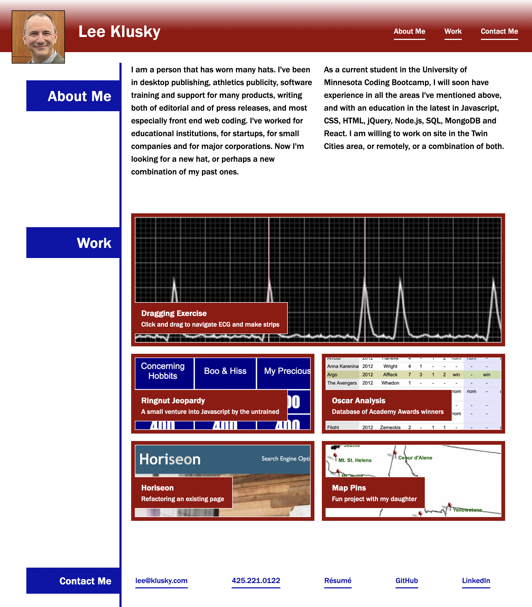

# Portfolio

## Description

I wanted to create a useful web page for potential employers to see me and to get a feel for my skills and my personality. I wanted to provide some text in my own words, some samples of my work, and all the information and links they'll need to reach out to me. I hope this page will inspire them to do that.

I also wanted to build this page in such a way that the page itself demonstrates my skills as a front end coder. At the moment, the skills I used are limited to HTML and CSS...but in the near future it will include JavaScript and other web technologies.

You can access this page at [this location](https://lkalliance.github.io/module-2-challenge/ "Lee Klusky's portfolio").

## Usage

This page, at the moment, works like any other static page on the World Wide Web. The menu at the top will scroll the user to each of the labeled sections. Clicking on any of the work samples I've listed will launch a new browser tab or window, and render that work on its own page. The "Contact Me" links at the bottom do not all work at this time. The email link, GitHub link and LinkedIn link all do in fact work as they ought; the telephone number link and the résumé link do not yet have destinations...but they will soon!

## Installation

There are no installations necessary for this page to operate. It currently uses just HTML and CSS, technologies that are built into any web browser. You do not even need CSS to be turned on: the page will still function as it should, though it will look a little less interesting.

## Credits

I created all the code for this page, but it would not be possible without the instruction and guidance of the staff at the University of Minnesota Coding Boot Camp, nor without the resources at [W3 Schools](https://www.w3schools.com "Learn to Code") and the [Mozilla Developers' Network](https://developer.mozilla.org "Resources for developers, by developers").
